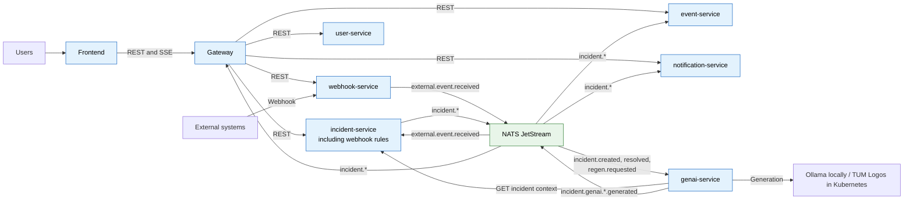

# DevOps Project 2026

Lightweight incident management system - detect, track, and resolve incidents with an immutable event log and AI-assisted analysis.

> TUM DevOps Project - Spring 2026 · Team Panic! At the Console


## Try It (Grading and Evaluation)

The application is deployed in two environments:

- **Kubernetes (TUM stud cluster):** <https://team-panic-at-the-console-devops26.stud.k8s.aet.cit.tum.de/>
- **Azure VM:** <http://20.52.156.209:8080/>

No credentials are needed up front: register a new account with an arbitrary name, email (e.g. `evaluation@example.com`), and password, and leave the invite code empty (no invite code is set for the demo deployments).

To build and run the stack locally, Docker is the only prerequisite:

```bash
docker compose up --build
```

Pixi is only needed for development tasks (lint, tests, hooks); see [Installation](#installation) and [Local Runtime](#local-runtime).

## Installation

Prerequisites:

- Docker: sufficient to build and run the local compose stack
- Git and Pixi: needed for development tasks (lint, tests, hooks, deploys)

Install Pixi on macOS:

```bash
brew install pixi
```

For other platforms, see the [Pixi installation guide](https://pixi.sh/latest/installation/).

Install project tooling and Git hooks:

```bash
pixi install
pixi run pre-commit-install
```

## Project Structure

```text
.
├── api/                        # OpenAPI contract and generated-client tooling
│   ├── openapi.yaml
│   └── specs/
├── services/
│   ├── frontend/               # Web dashboard (Client subsystem)
│   ├── gateway/                # API gateway - single entry point
│   ├── incident-service/       # Core incident CRUD, lifecycle, and external-event handling
│   ├── event-service/          # Append-only event log / timeline
│   ├── user-service/           # Auth + role management
│   ├── notification-service/   # Notifies users on incident events
│   ├── webhook-service/        # Receives CI/CD webhook events
│   ├── genai-service/          # AI summaries, triage, postmortem drafts
│   └── generated/              # API clients generated from api/openapi.yaml
├── infra/
│   ├── helm/                   # Helm chart + SOPS-encrypted deploy values
│   └── compose/                # Local docker-compose stack
├── docs/
│   ├── adr/                    # Architecture decision records
│   ├── schema.md               # Persistence schema snapshot
│   └── deliverables/           # UML diagrams and project deliverables
├── tests/                      # Contract and end-to-end tests
└── scripts/
```

## Architecture

The frontend uses REST through the gateway for request/response operations. `incident-service` owns incident state and publishes lifecycle events to NATS JetStream. The event log, notifications, GenAI processing, and live UI updates react asynchronously to those events. Each stateful service owns its data in a separate PostgreSQL database.

### Service communication



- [Subsystem decomposition](docs/deliverables/2026-05-08-uml-diagrams/component_diagram.md)
- [Deployment layout](docs/deliverables/2026-05-08-uml-diagrams/deployment_diagram.md)
- [Incident processing sequence](docs/deliverables/2026-05-08-uml-diagrams/sequence_diagram.md)
- [Incident lifecycle](docs/deliverables/2026-05-08-uml-diagrams/state_diagram.md)
- [Analysis object model](docs/deliverables/2026-05-08-uml-diagrams/analysis_object_model.md)
- [Use cases](docs/deliverables/2026-05-08-uml-diagrams/use_case_diagram.md)
- [Persistence schema](docs/schema.md)
- [Architecture decision records](docs/adr/)

### Incident workflow

Users create and manage incidents through the dashboard. `incident-service` persists the current state, then publishes lifecycle events to NATS. `event-service` writes the immutable timeline, `notification-service` stores in-app notifications, `genai-service` creates analysis, and the gateway forwards changes to connected browsers through Server-Sent Events.

`webhook-service` persists signed external events and publishes `external.event.received` to NATS. `incident-service` consumes that event and evaluates it against configurable incident rules, managed through the API and the frontend Rules page. Each rule matches conditions on the event's `source`, `eventType`, or `payload` fields (operators like equals, contains, regex) and creates an incident with a templated title, description, severity, and metadata. A per-rule deduplication key template prevents duplicate incidents for the same underlying event. On first start, a default "GitHub CI failures" rule is seeded that opens a `SEV2` incident for `ci_failure` events.

### GenAI

`genai-service` is a separate, stateless FastAPI service. It consumes incident lifecycle events from NATS, fetches incident context from `incident-service`, generates summaries, severity suggestions, solution suggestions, and postmortems, then publishes the results back through NATS. It uses Ollama (`qwen2.5:3b`) in local Compose and TUM Logos in Kubernetes.

### API

The combined [OpenAPI contract](api/openapi.yaml) defines the public API. Run the stack and open [Swagger UI](http://localhost:8080/swagger) to explore and invoke endpoints locally. `pixi run openapi-lint` validates the contract; `pixi run mock-api` starts a Prism mock server for frontend development.

## CI/CD

See [.github/workflows/](.github/workflows/).

| Workflow | Trigger | Purpose |
| --- | --- | --- |
| `ci.yml` | PR, merge queue | Lint and lockfile consistency |
| `java-tests.yml` | Push, PR, merge queue | Java service unit tests |
| `frontend-tests.yml` | Push, PR, merge queue | Frontend tests |
| `python-tests.yml` | Push, PR, merge queue | GenAI type check and tests |
| `ollama-integration.yml` | Manual dispatch, weekly schedule | GenAI integration tests against a real Ollama |
| `openapi-lint.yml` | Push, PR, merge queue | OpenAPI lint and code-generation validation |
| `compose-validate.yml` | Push, PR, merge queue | Compose validation and full-stack smoke test |
| `container-ci.yml` | PR, merge queue | Container build validation without pushing images |
| `workflow-hygiene.yml` | Push, PR, merge queue | actionlint on workflow files |
| `semantic-pr.yml` | PR | Conventional Commits PR title check |
| `pr-labeler.yml` | PR | Auto-labels pull requests |
| `_build-images.yml` | Called by `release.yml`, `deploy-on-merge.yml`, `container-ci.yml` | Reusable image build (and optional push) matrix |
| `deploy-on-merge.yml` | Push to `main` | Build, push, and deploy to Kubernetes |
| `release.yml` | GitHub Release | Build, push, and deploy to Kubernetes and Azure |
| `deploy-k8s.yml` | Called by `release.yml`, manual dispatch | Kubernetes deployment; decrypts SOPS values |
| `deploy-azure-vm.yml` | Called by `release.yml`, manual dispatch | Azure deployment via OIDC and Ansible |
| `terraform-destroy.yml` | Manual dispatch | Tears down the Azure VM infrastructure |

**PR CI does not decrypt SOPS or deploy to the cluster** (no cluster credentials on PRs). Deploy workflows gate on the `kubernetes` and `azure` GitHub Environments; credentials live in repository Actions secrets (below).

### Release tags

Publish a GitHub Release to trigger `release.yml`, the full release pipeline: it builds and pushes all images to GHCR (tagged with the release version and `latest`), then runs `deploy-k8s.yml` and `deploy-azure-vm.yml`. Both deploys use `needs: build`, so they start only once every image is pushed; a failed build aborts the deploys. Each deploy workflow gates on its own environment (`kubernetes` for Helm, `azure` for Terraform + Ansible).

### Helm + SOPS

Production deploy secrets live in `infra/helm/secrets/values.prod.enc.yaml` (encrypted, committed). Plaintext defaults for local chart dev stay in `infra/helm/devops-platform/values.yaml`.

**Pixi tasks** (deploy environment; install with `pixi install`):

| Task                                | Purpose                                           |
| ----------------------------------- | ------------------------------------------------- |
| `pixi run -e deploy helm-deploy`    | Decrypt SOPS values and install/upgrade the chart |
| `pixi run -e deploy helm-uninstall` | Remove the Helm release                           |
| `pixi run -e deploy k9s`            | Open k9s (uses your active kubeconfig)            |

**Flow (local or CI):**

1. `pixi run -e deploy helm-deploy` decrypts `values.prod.enc.yaml` with `SOPS_AGE_KEY`.
2. Helm installs/upgrades `infra/helm/devops-platform` with `--values` (decrypted file) and `--set global.image.tag=$TAG`.
3. The chart creates `postgres-credentials` from `secrets.postgresPassword` in the decrypted file (falls back to `postgres.password` in `values.yaml` if unset).

**Key files:**

| File                                              | Purpose                                                           |
| ------------------------------------------------- | ----------------------------------------------------------------- |
| `.sops.yaml`                                      | Which AGE public keys may encrypt `infra/helm/secrets/*.enc.yaml` |
| `infra/helm/secrets/values.prod.enc.yaml`         | Encrypted prod overrides (commit this)                            |
| `infra/helm/secrets/values.prod.dec.example.yaml` | Template for plaintext before first encrypt                       |
| `infra/helm/devops-platform/files/init-dbs.sh`    | Postgres DB init (compose + Helm)                                 |

Never commit `*.dec.yaml` or `~/.config/sops/age/keys.txt` (gitignored / local only).

#### GitHub Actions secrets (Kubernetes deploy)

Configure under **Settings → Secrets and variables → Actions** (repository scope):

| Name               | Type     | Used for                                       |
| ------------------ | -------- | ---------------------------------------------- |
| `KUBECONFIG_B64`   | Secret   | Cluster access (base64 kubeconfig)             |
| `SOPS_AGE_KEY`     | Secret   | Full AGE private key file (same as `keys.txt`) |
| `DEPLOY_NAMESPACE` | Variable | e.g. `team-panic-at-the-console-devops26`      |

`deploy-k8s.yml` runs `pixi run -e deploy helm-deploy` with these values. Azure deploy secrets are documented in `deploy-azure-vm.yml`.

#### New team member access

You need the **team AGE private key** that matches `.sops.yaml` (recipient `age16sgwfcnyz...`). Without it, `sops --decrypt` fails.

**Option A (usual):** A teammate shares the team `keys.txt` out of band (1Password, in person, etc.). Store it as:

```bash
mkdir -p ~/.config/sops/age
chmod 700 ~/.config/sops/age
# paste the team key file
chmod 600 ~/.config/sops/age/keys.txt
export SOPS_AGE_KEY_FILE=~/.config/sops/age/keys.txt
```

**Option B (new key):** Generate a key with `pixi run -e deploy age-keygen -o ~/.config/sops/age/keys.txt`, send the `# public key: age1...` line to someone who can already decrypt. They add your public key to `.sops.yaml` and re-encrypt:

```bash
pixi run -e deploy sops updatekeys infra/helm/secrets/values.prod.enc.yaml
```

Then commit the updated `.sops.yaml` and `values.prod.enc.yaml`.

**Verify access:**

```bash
export SOPS_AGE_KEY_FILE=~/.config/sops/age/keys.txt
pixi run -e deploy sops --decrypt infra/helm/secrets/values.prod.enc.yaml
```

#### Edit production secrets

Use vim (avoid Cursor/VS Code as `$EDITOR` if it opens empty):

```bash
export SOPS_AGE_KEY_FILE=~/.config/sops/age/keys.txt
EDITOR=vim pixi run -e deploy sops infra/helm/secrets/values.prod.enc.yaml
```

Or set one field:

```bash
pixi run -e deploy sops set infra/helm/secrets/values.prod.enc.yaml \
  '["secrets"]["postgresPassword"]' '"your-password"'
```

Commit only the updated `values.prod.enc.yaml`.

Expected decrypted shape:

```yaml
global:
  image:
    tag: latest
secrets:
  postgresPassword: "<cluster-postgres-password>"
```

#### Deploy / uninstall locally

Required environment variables for `helm-deploy`: `KUBECONFIG_B64`, `SOPS_AGE_KEY`, `DEPLOY_NAMESPACE`, `TAG`.  
`helm-uninstall` needs `KUBECONFIG_B64` and `DEPLOY_NAMESPACE` only.

```bash
export SOPS_AGE_KEY_FILE=~/.config/sops/age/keys.txt

KUBECONFIG_B64=$(base64 < ~/.kube/config | tr -d '\n') \
SOPS_AGE_KEY="$(cat ~/.config/sops/age/keys.txt)" \
DEPLOY_NAMESPACE=team-panic-at-the-console-devops26 \
TAG=v0.0.3 \
pixi run -e deploy helm-deploy

KUBECONFIG_B64=$(base64 < ~/.kube/config | tr -d '\n') \
DEPLOY_NAMESPACE=team-panic-at-the-console-devops26 \
pixi run -e deploy helm-uninstall
```

Optional: `VALUES_FILE=path/to/other.enc.yaml` when running `helm-deploy`.

#### URLs and routes (stud cluster)

`https://team-panic-at-the-console-devops26.stud.k8s.aet.cit.tum.de/`:

| Path | Service |
| ---- | ------- |
| `/` | Frontend |
| `/api` | Gateway (`/api/v1/...`) |
| `/swagger` | Swagger UI (OpenAPI) |
| `/grafana` | Grafana (dashboards) |
| `/prometheus` | Prometheus UI |

Ingress uses cert-manager (`letsencrypt-prod`) and TLS secret `devops-platform-tls`.

Observability is self-hosted in the namespace: the chart deploys its own Prometheus and Grafana as plain Deployments (no kube-prometheus-stack, no CRDs, no cluster-scoped RBAC). Prometheus scrapes every service via static config and loads the alert rules directly; Grafana is auto-provisioned with the Prometheus datasource and the exported dashboards (Spring services + GenAI). Both are reachable through the ingress at `/grafana` and `/prometheus`. For clusters that already run prometheus-operator, set `monitoring.operatorCrds.enabled=true` to switch to PodMonitor + PrometheusRule CRs consumed by the shared operator instead.

For local compose URLs, see [Local Runtime](#urls-and-routes-local-compose).

#### Debug the cluster

```bash
pixi run -e deploy k9s
```

Use a kubeconfig/context that points at the stud cluster (`kubectl config current-context`).

## Testing

```bash
# Lint (all services, same as CI)
pixi run lint

# Frontend
(cd services/frontend && pixi run test)

# Java services with test tasks
(cd services/incident-service && pixi run test)
(cd services/event-service && pixi run test)
(cd services/gateway && pixi run test)
(cd services/notification-service && pixi run test)
(cd services/user-service && pixi run test)
(cd services/webhook-service && pixi run test)

# genai-service (Python)
(cd services/genai-service && pixi run test)
```

## Local Runtime

A single command from the repository root starts the full stack; Docker is the only prerequisite:

```bash
docker compose up           # published ghcr.io :latest images
docker compose up --build   # rebuild from local source
```

Docker auto-discovers the root `compose.yaml` (a symlink to `infra/compose/docker-compose.yml`) and starts all services plus shared infrastructure (Postgres, NATS). Service env vars (`DATABASE_URL`, `NATS_URL`) are pre-wired, and every variable has a baked-in default.

For development, the Pixi wrapper is handy:

```bash
pixi run compose-up
```

It always passes `--build` (so local source changes are rebuilt instead of reusing stale `:latest` images) and `--env-file .env.example`. Stop the stack with `docker compose down` or `pixi run compose-down`.

#### URLs and routes (local compose)

| URL | Service |
| --- | ------- |
| `http://localhost:8080/` | Frontend (via `edge`) |
| `http://localhost:8080/api/v1/` | Gateway (via `edge`; e.g. `/health`) |
| `http://localhost:8080/swagger` | Swagger UI |
| `http://localhost:8080/grafana` | Grafana (via `edge`; `admin` / `admin`) |
| `http://localhost:8080/prometheus` | Prometheus (via `edge`) |
| `http://localhost:3000/` | Frontend (direct) |
| `http://localhost:3030/` | Grafana (direct) |
| `http://localhost:9090/prometheus` | Prometheus (direct) |
| `http://localhost:8087/metrics` | genai-service metrics |

Same path layout as the stud-cluster ingress (`/api`, `/swagger`, `/grafana`, `/prometheus`); the direct host ports stay published for local debugging. Grafana talks to Prometheus at `http://prometheus:9090/prometheus` inside Docker; use `localhost` from your browser. After boot: `pixi run compose-smoke-genai-metrics` to fill the genai dashboard.

Shared non-secret defaults (for example `NATS_URL`) are defined once in `.env.example` and referenced from service-specific environment sections.

- Override the image tag: `IMAGE_TAG=v0.0.1 pixi run compose-up`

## Troubleshooting

| Symptom | Resolution |
| --- | --- |
| Compose cannot start | Start Docker Desktop, then rerun `docker compose up`. |
| A local port is already in use | Stop the process using the port or run `pixi run compose-down` to remove the local stack. |
| Grafana panels are empty after startup | Run `pixi run compose-smoke-genai-metrics` to generate sample GenAI metrics. |
| Kubernetes deployment cannot decrypt values | Configure `SOPS_AGE_KEY` as described in [New team member access](#new-team-member-access). |


## Mock API Server

Spin up a local HTTP mock server driven by `api/openapi.yaml` using [Prism](https://stoplight.io/open-source/prism):

```bash
pixi run mock-api
```

Prism reads the spec and serves auto-generated responses on `http://localhost:4010` (for example, `http://localhost:4010/health`). No services need to be running: useful for frontend development and API exploration before backends exist.

## Student Responsibilities

| Microservice | Primary owner | Partial ownership / domain |
|---|---|---|
| `frontend` | Leon | Dashboard and user-facing workflows |
| `gateway` | Manuel | API routing, external API boundary, OpenAPI integration |
| `incident-service` | Florian | Incident lifecycle and core domain |
| `event-service` | Florian | Immutable event log and timeline data |
| `user-service` | Leon | Authentication, users, roles, identity |
| `notification-service` | Leon | In-app notifications and read state |
| `webhook-service` | Leon | Webhook ingestion and source management |
| `genai-service` | Manuel | AI generation, providers, and NATS processing |

[@florian-pesco](https://github.com/florian-pesco)

- **Project role**: Core domain backend and event-driven incident workflow
- **Primary services**: `services/incident-service`, `services/event-service`
- **Domains**:
  - Incident lifecycle, persistence, REST API, and NATS publishing/subscription
  - Append-only event log and incident timeline data
  - External-event rule evaluation and automatic incident creation
  - Database schema documentation and product/backlog documentation

[@ManuelLerchner](https://github.com/ManuelLerchner)

- **Project role**: Platform architecture, GenAI, and delivery infrastructure
- **Primary services**: `services/genai-service`, `services/gateway`
- **Domains**:
  - GenAI generation pipeline: structured prompts, Ollama and TUM Logos providers, NATS integration, evaluation, and integration tests
  - API gateway, OpenAPI contracts, generated clients, Swagger UI, and code-generation workflow
  - Platform infrastructure: Docker Compose, Helm, Kubernetes, SOPS, deployment workflows, and service health checks
  - Observability: Prometheus, Grafana, alerting, JVM sizing, resource-quota hardening
  - CI/CD, dependency/security maintenance, architecture decisions, ADRs, and project documentation

[@LeonSpoerl](https://github.com/LeonSpoerl)

- **Project role**: Frontend, identity, and user-facing workflow integration
- **Primary services**: `services/frontend`, `services/user-service`, `services/notification-service`, `services/webhook-service`
- **Domains**:
  - React dashboard, typed API client, incident workflow UI, timeline, AI output display, and frontend test setup
  - Session authentication, invite-only registration, user management, and identity propagation
  - In-app notifications, per-user read state, assignee targeting, and notification UI
  - Webhook ingestion, audit trail, source management, and frontend integration
  - Edge routing/ingress, Azure/Terraform deployment work, and shared Helm/Compose operational fixes

Shared responsibility covers Helm/Compose operations, CI, OpenAPI alignment, and documentation.


## Development Memes

Every major milestone was accompanied by at least one meme. The collection below chronicles the highs, the lows, and the occasional "why does this suddenly work?" moments of the project.

<table>
  <tr>
    <td></td>
    <td></td>
    <td></td>
    <td></td>
  </tr>
  <tr>
    <td></td>
    <td></td>
    <td></td>
    <td></td>
  </tr>
</table>

