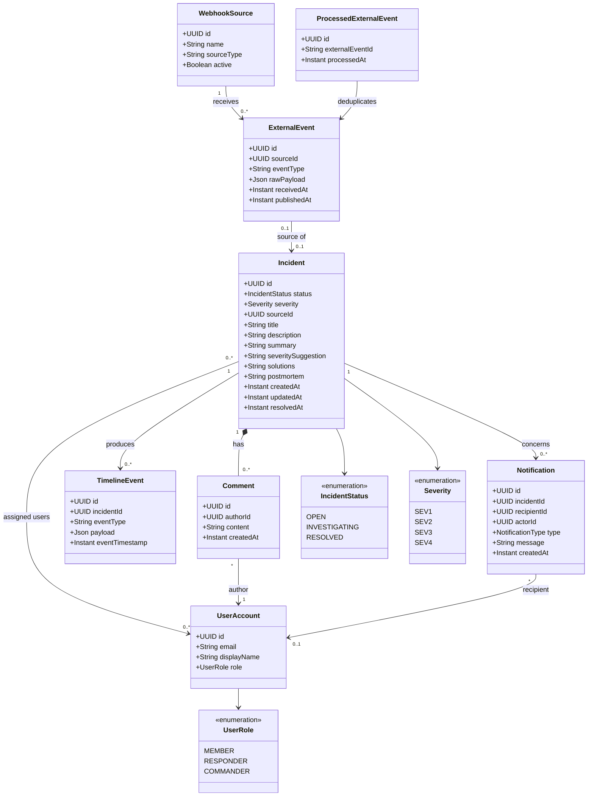

## Incident Management System - Analysis Object Model

`incident-service` owns Incident, Comment, and ProcessedExternalEvent. `ProcessedExternalEvent` prevents duplicate webhook deliveries from creating multiple incidents. `event-service`, `user-service`, `notification-service`, and `webhook-service` own their respective models. The diagram shows domain relationships; services exchange identifiers and events instead of sharing a database.
