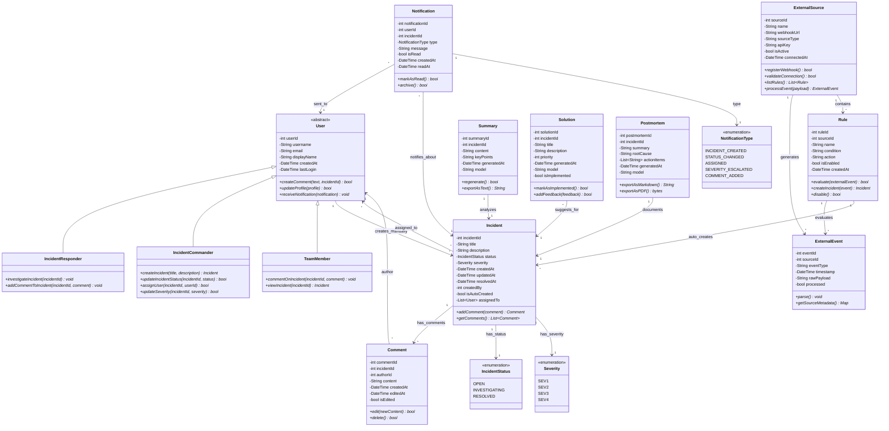

## Incident Management System - Analysis Object Model

```mermaid
classDiagram

    %% Enumerations
    class IncidentStatus{
        <<enumeration>>
        OPEN
        INVESTIGATING
        RESOLVED
    }

    class Severity{
        <<enumeration>>
        SEV1
        SEV2
        SEV3
        SEV4
    }


    class NotificationType{
        <<enumeration>>
        INCIDENT_CREATED
        STATUS_CHANGED
        ASSIGNED
        SEVERITY_ESCALATED
        COMMENT_ADDED
    }

    %% User Hierarchy
    class User {
        <<abstract>>
        -int userId
        -String username
        -String email
        -String displayName
        -DateTime createdAt
        -DateTime lastLogin
        +createComment(text, incidentId)* bool
        +updateProfile(profile)* bool
        +receiveNotification(notification)* void
    }

    class IncidentResponder {
        +investigateIncident(incidentId)* void
        +addCommentToIncident(incidentId, comment)* void
    }

    class IncidentCommander {
        +createIncident(title, description)* Incident
        +updateIncidentStatus(incidentId, status)* bool
        +assignUser(incidentId, userId)* bool
        +updateSeverity(incidentId, severity)* bool
    }

    class TeamMember {
        +commentOnIncident(incidentId, comment)* void
        +viewIncident(incidentId)* Incident
    }

    User <|-- IncidentResponder
    User <|-- IncidentCommander
    User <|-- TeamMember

    class Incident {
        -int incidentId
        -String title
        -String description
        -IncidentStatus status
        -Severity severity
        -DateTime createdAt
        -DateTime updatedAt
        -DateTime resolvedAt
        -int createdBy
        -bool isAutoCreated
        -List~User~ assignedTo
        +addComment(comment)* Comment
        +getComments()* List~Comment~
    }


    class ExternalEvent {
        -int eventId
        -int sourceId
        -String eventType
        -DateTime timestamp
        -String rawPayload
        -bool processed
        +parse()* void
        +getSourceMetadata()* Map
    }

    class Comment {
        -int commentId
        -int incidentId
        -int authorId
        -String content
        -DateTime createdAt
        -DateTime editedAt
        -bool isEdited
        +edit(newContent)* bool
        +delete()* bool
    }

    class Notification {
        -int notificationId
        -int userId
        -int incidentId
        -NotificationType type
        -String message
        -bool isRead
        -DateTime createdAt
        -DateTime readAt
        +markAsRead()* bool
        +archive()* bool
    }

    %% AI & Analysis Classes
    class Summary {
        -int summaryId
        -int incidentId
        -String content
        -String keyPoints
        -DateTime generatedAt
        -String model
        +regenerate()* bool
        +exportAsText()* String
    }

    class Solution {
        -int solutionId
        -int incidentId
        -String title
        -String description
        -int priority
        -DateTime generatedAt
        -String model
        -bool isImplemented
        +markAsImplemented()* bool
        +addFeedback(feedback)* bool
    }

    class Postmortem {
        -int postmortemId
        -int incidentId
        -String summary
        -String rootCause
        -List~String~ actionItems
        -DateTime generatedAt
        -String model
        +exportAsMarkdown()* String
        +exportAsPDF()* bytes
    }

    %% Automation & Configuration Classes
    class Rule {
        -int ruleId
        -int sourceId
        -String name
        -String condition
        -String action
        -bool isEnabled
        -DateTime createdAt
        +evaluate(externalEvent)* bool
        +createIncident(event)* Incident
        +disable()* bool
    }

    class ExternalSource {
        -int sourceId
        -String name
        -String webhookUrl
        -String sourceType
        -String apiKey
        -bool isActive
        -DateTime connectedAt
        +registerWebhook()* bool
        +validateConnection()* bool
        +listRules()* List~Rule~
        +processEvent(payload)* ExternalEvent
    }

    %% Relationships - Data Flow
    ExternalSource "1" --> "*" ExternalEvent : generates
    ExternalSource "1" --> "*" Rule : contains

    %% External Event → Rule → Incident
    Rule "1" --> "*" ExternalEvent : evaluates
    Rule "1" --> "*" Incident : auto_creates

    %% User → Incident (Manual Creation & Assignment)
    User "1" --> "*" Incident : creates_manually
    Incident "*" --> "*" User : assigned_to

    %% Comments
    Comment "*" --> "1" User : author
    Incident "1" --> "*" Comment : has_comments

    %% Incident Status & Severity
    Incident "1" --> "1" IncidentStatus : has_status
    Incident "1" --> "1" Severity : has_severity

    %% Notifications
    Notification "*" --> "1" User : sent_to
    Notification "*" --> "1" Incident : notifies_about
    Notification "1" --> "1" NotificationType : type

    %% AI Analysis
    Summary "1" --> "1" Incident : analyzes
    Solution "*" --> "1" Incident : suggests_for
    Postmortem "1" --> "1" Incident : documents

    %% Style definitions
    classDef entity fill:#e1f5ff,stroke:#01579b,stroke-width:2px
    classDef userType fill:#b3e5fc,stroke:#01579b,stroke-width:2px
    classDef enumeration fill:#fff3e0,stroke:#e65100,stroke-width:2px
    classDef event fill:#f0f4c3,stroke:#827717,stroke-width:2px
    classDef service fill:#f3e5f5,stroke:#4a148c,stroke-width:2px
    classDef analysis fill:#e8f5e9,stroke:#1b5e20,stroke-width:2px

    cssClass "User" entity
    cssClass "IncidentResponder" userType
    cssClass "IncidentCommander" userType
    cssClass "TeamMember" userType
    cssClass "Incident" entity
    cssClass "Comment" entity
    cssClass "Notification" entity
    cssClass "ExternalEvent" event
    cssClass "IncidentStatus" enumeration
    cssClass "Severity" enumeration
    cssClass "NotificationType" enumeration
    cssClass "Rule" service
    cssClass "ExternalSource" service
    cssClass "Summary" analysis
    cssClass "Solution" analysis
    cssClass "Postmortem" analysis
```
