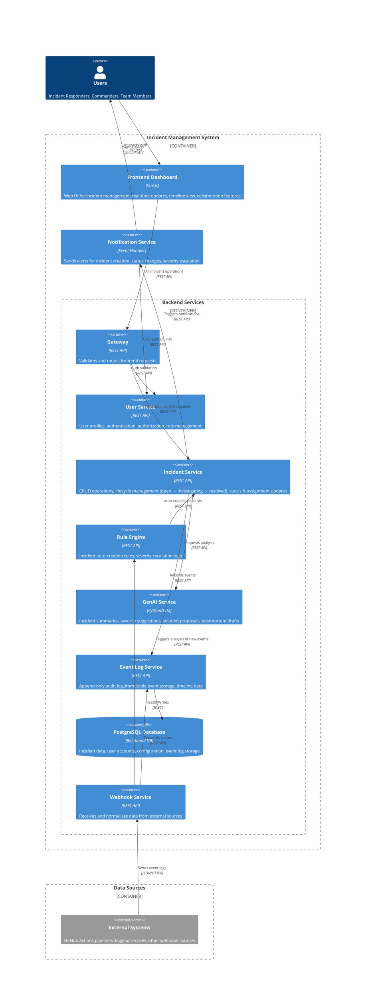

## Incident Management System - Subsystem Decomposition Diagram

```mermaid
C4Container

  Person(users, "Users", "Incident Responders, Commanders, Team Members")

  Container_Boundary(system, "Incident Management System") {
    Container(frontend, "Frontend Dashboard", "Vue.js", "Web UI for incident management, real-time updates, timeline view, collaboration features")
    Container(notification, "Notification Service", "Event Handler", "Sends alerts for incident creation, status changes, severity escalation")


    Container_Boundary(backend, "Backend Services") {
      Container(gateway, "Gateway", "REST API", "Validates and routes frontend requests")
      Container(user_service, "User Service", "REST API", "User profiles, authentication, authorization, role management")

      Container(incident_service, "Incident Service", "REST API", "CRUD operations, lifecycle management (open → investigating → resolved), status & assignment updates")
      Container(rule_engine, "Rule Engine", "REST API", "Incident auto-creation rules, severity escalation logic")


      Container(genai_service, "GenAI Service", "Python/LLM", "Incident summaries, severity suggestions, solution proposals, postmortem drafts")
      Container(event_log, "Event Log Service", "REST API", "Append-only audit log, immutable event storage, timeline data")

      ContainerDb(database, "PostgreSQL Database", "Relational DB", "Incident data, user accounts, configuration, event log storage")
      Container(webhook, "Webhook Service", "REST API", "Receives and normalizes data from external sources")
    }
  }

  Container_Boundary(ext, "Data Sources"){
    System_Ext(external_systems, "External Systems", "GitHub Actions pipelines, logging services, other webhook sources")
  }

  Rel(users, frontend, "Interacts with", "HTTPS")
  Rel(frontend, gateway, "All incident operations", "REST API")
  Rel(gateway, incident_service, "Validated incident requests", "REST API")
  Rel(gateway, user_service, "Auth validation", "REST API")

  Rel(external_systems, webhook, "Sends event logs", "JSON/HTTPS")
  Rel(rule_engine, incident_service, "Auto-creates incidents", "REST API")

  Rel(webhook, rule_engine, "Triggers analysis of new events", "REST API")
  Rel(webhook, event_log, "Forwards events", "REST API")

  Rel(incident_service, event_log, "Records events", "REST API")
  Rel(incident_service, genai_service, "Requests analysis", "REST API")
  Rel(incident_service, notification, "Triggers notifications", "REST API")

  Rel(event_log, database, "Reads/Writes", "JDBC")
  Rel(notification, user_service, "User contact info", "REST API")
  Rel(notification, users, "Sends alerts", "Email/Push")

  UpdateRelStyle(gateway, incident_service, $offsetX="-50",$offsetY="-20")
  UpdateRelStyle(gateway, user_service, $offsetX="-40",$offsetY="-40")
  UpdateRelStyle(incident_service, notification, $offsetY="-160")
  UpdateRelStyle(users, frontend, $offsetX="-50",$offsetY="40")
  UpdateRelStyle(frontend, gateway, $offsetX="10", $offsetY="20")
  UpdateRelStyle(rule_engine, incident_service, $offsetX="-60", $offsetY="-30")
  UpdateRelStyle(event_log, database, $offsetX="-40", $offsetY="-10")
  UpdateRelStyle(notification, users, $offsetY="-60")
  UpdateRelStyle(webhook, rule_engine, $offsetY="-110", $offsetX="70")
  UpdateRelStyle(notification, user_service, $offsetY="30", $offsetX="0")

  UpdateLayoutConfig($c4ShapeInRow="2", $c4BoundaryInRow="1")
```
