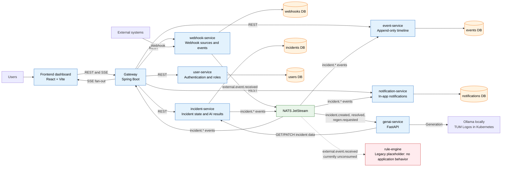

## Incident Management System - Subsystem Decomposition Diagram

REST serves request/response flows. NATS JetStream carries asynchronous side effects and gateway fan-out for real-time updates. Each stateful service owns its database; `incident-service` owns the current incident state and generated AI fields.
