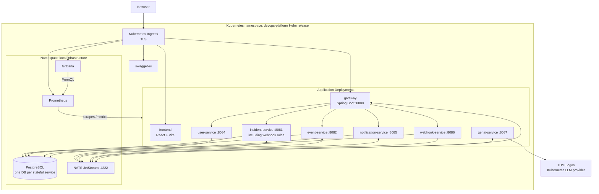

## Incident Management System - Deployment Diagram

The Helm chart self-hosts Prometheus and Grafana as namespace-local plain Deployments. Ollama runs with the local Compose stack; the Kubernetes deployment uses TUM Logos because the cluster quota cannot accommodate an in-cluster model. `incident-service` includes webhook-rule evaluation.
