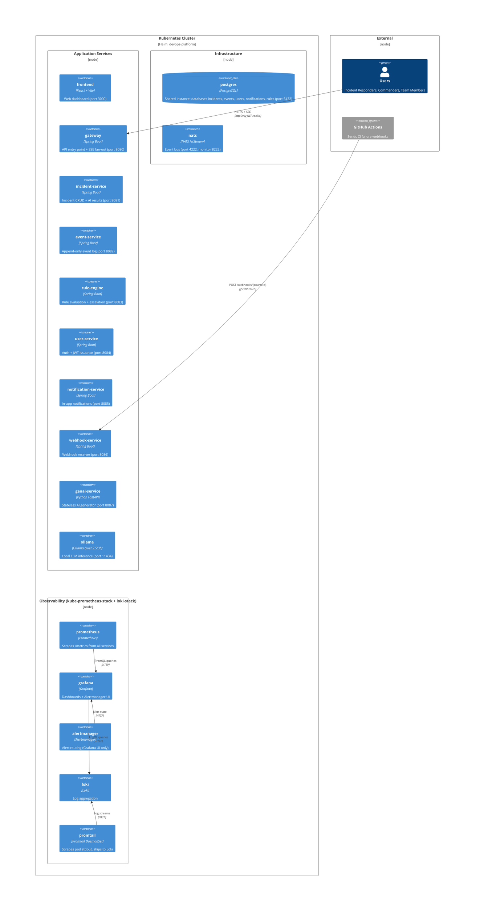

## Incident Management System - Deployment Diagram

Shows the Kubernetes deployment layout, Helm chart structure, and observability stack.

```mermaid
C4Deployment

  Deployment_Node(k8s, "Kubernetes Cluster", "Helm: devops-platform") {

    Deployment_Node(app, "Application Services") {
      Container(frontend, "frontend", "React + Vite", "Web dashboard (port 3000)")
      Container(gateway, "gateway", "Spring Boot", "API entry point + SSE fan-out (port 8080)")
      Container(incident_svc, "incident-service", "Spring Boot", "Incident CRUD + AI results (port 8081)")
      Container(event_svc, "event-service", "Spring Boot", "Append-only event log (port 8082)")
      Container(rule_engine, "rule-engine", "Spring Boot", "Rule evaluation + escalation (port 8083)")
      Container(user_svc, "user-service", "Spring Boot", "Auth + JWT issuance (port 8084)")
      Container(notif_svc, "notification-service", "Spring Boot", "In-app notifications (port 8085)")
      Container(webhook_svc, "webhook-service", "Spring Boot", "Webhook receiver (port 8086)")
      Container(genai_svc, "genai-service", "Python FastAPI", "Stateless AI generator (port 8087)")
      Container(ollama, "ollama", "Ollama qwen2.5:3b", "Local LLM inference (port 11434)")
    }

    Deployment_Node(infra, "Infrastructure") {
      ContainerDb(postgres, "postgres", "PostgreSQL", "Shared instance: databases incidents, events, users, notifications, rules (port 5432)")
      Container(nats, "nats", "NATS JetStream", "Event bus (port 4222, monitor 8222)")
    }

    Deployment_Node(obs, "Observability (kube-prometheus-stack + loki-stack)") {
      Container(prometheus, "prometheus", "Prometheus", "Scrapes /metrics from all services")
      Container(grafana, "grafana", "Grafana", "Dashboards + Alertmanager UI")
      Container(alertmanager, "alertmanager", "Alertmanager", "Alert routing (Grafana UI only)")
      Container(loki, "loki", "Loki", "Log aggregation")
      Container(promtail, "promtail", "Promtail DaemonSet", "Scrapes pod stdout, ships to Loki")
    }
  }

  Deployment_Node(external, "External") {
    Person(users, "Users", "Incident Responders, Commanders, Team Members")
    System_Ext(ci, "GitHub Actions", "Sends CI failure webhooks")
  }

  Rel(users, gateway, "HTTPS + SSE", "httpOnly JWT cookie")
  Rel(ci, webhook_svc, "POST /webhooks/{sourceId}", "JSON/HTTPS")
  Rel(prometheus, grafana, "PromQL queries", "HTTP")
  Rel(alertmanager, grafana, "Alert state", "HTTP")
  Rel(promtail, loki, "Log streams", "HTTP")
  Rel(grafana, loki, "LogQL queries", "HTTP")
```
