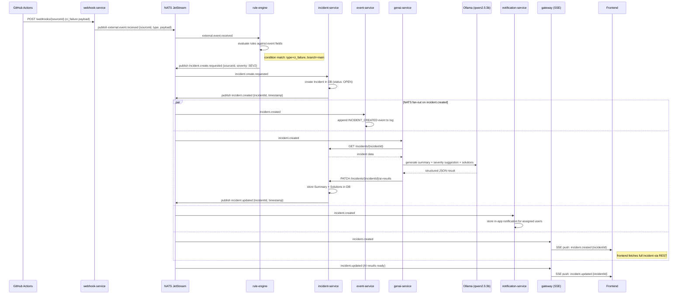

## Incident Management System - CI Failure Auto-Incident Sequence

Shows the full NATS-driven flow when a CI pipeline failure auto-creates an incident and fans out to all subscribers.

```mermaid
sequenceDiagram
    participant GH as GitHub Actions
    participant WH as webhook-service
    participant NATS as NATS JetStream
    participant RE as rule-engine
    participant IS as incident-service
    participant ES as event-service
    participant GS as genai-service
    participant Ollama as Ollama (qwen2.5:3b)
    participant NS as notification-service
    participant GW as gateway (SSE)
    participant FE as Frontend

    GH->>WH: POST /webhooks/{sourceId} (ci_failure payload)
    WH->>NATS: publish external.event.received {sourceId, type, payload}

    NATS->>RE: external.event.received
    RE->>RE: evaluate rules against event fields
    note right of RE: condition match: type=ci_failure, branch=main
    RE->>NATS: publish incident.create.requested {sourceId, severity: SEV2}

    NATS->>IS: incident.create.requested
    IS->>IS: create Incident in DB (status: OPEN)
    IS->>NATS: publish incident.created {incidentId, timestamp}

    par NATS fan-out on incident.created
        NATS->>ES: incident.created
        ES->>ES: append INCIDENT_CREATED event to log
    and
        NATS->>GS: incident.created
        GS->>IS: GET /incidents/{incidentId}
        IS-->>GS: incident data
        GS->>Ollama: generate summary + severity suggestion + solutions
        Ollama-->>GS: structured JSON result
        GS->>IS: PATCH /incidents/{incidentId}/ai-results
        IS->>IS: store Summary + Solutions in DB
        IS->>NATS: publish incident.updated {incidentId, timestamp}
    and
        NATS->>NS: incident.created
        NS->>NS: store in-app notification for assigned users
    and
        NATS->>GW: incident.created
        GW->>FE: SSE push: incident.created {incidentId}
        note right of FE: frontend fetches full incident via REST
    end

    NATS->>GW: incident.updated (AI results ready)
    GW->>FE: SSE push: incident.updated {incidentId}
```
