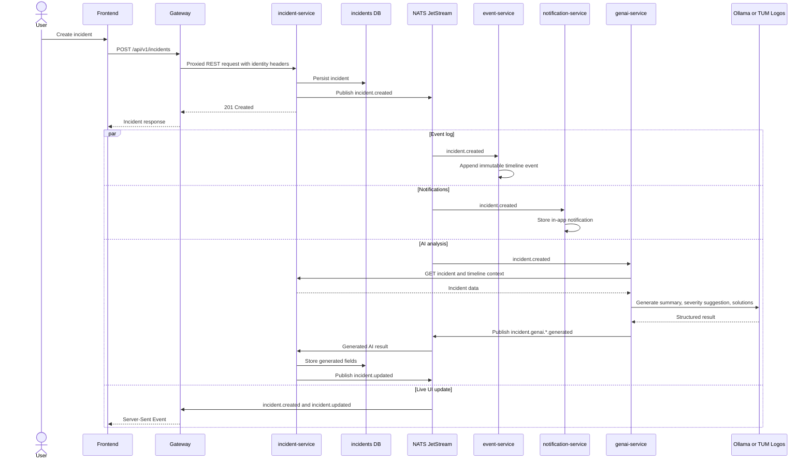

## Incident Management System - Incident Creation and Asynchronous Processing

Webhook ingestion follows a separate path: `webhook-service` persists an external event and publishes `external.event.received`. The event is retained for audit; automatic rule evaluation is not active while the legacy `rule-engine` placeholder remains.
