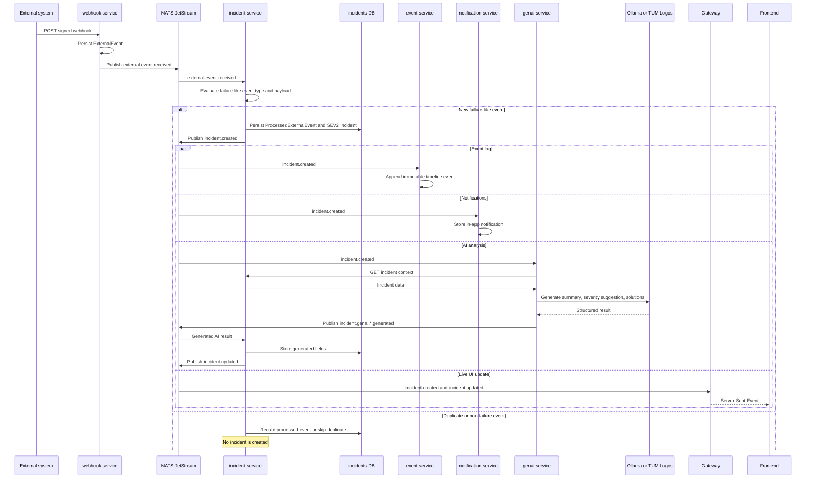

## Incident Management System - Webhook-driven Incident Processing

The embedded rule is deliberately small: it detects failure-like event types or payload values and creates a `SEV2` incident. It is not yet a configurable rule-policy engine.
