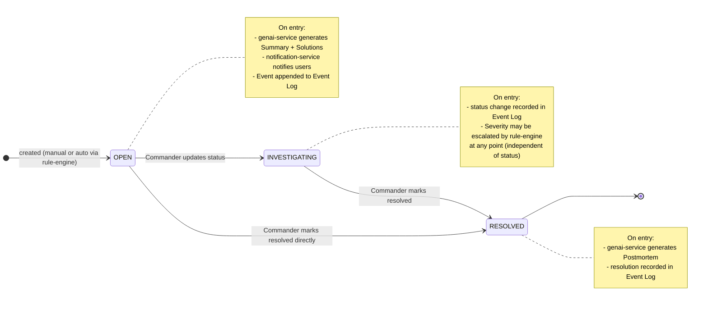
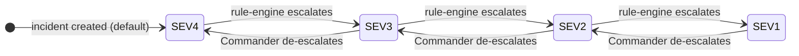

## Incident Management System - Incident Lifecycle State Machine

Shows valid status transitions and the side effects triggered at each state change.

## Severity (independent of status)

Severity is an attribute of the Incident, not a status. It can change in any state:

