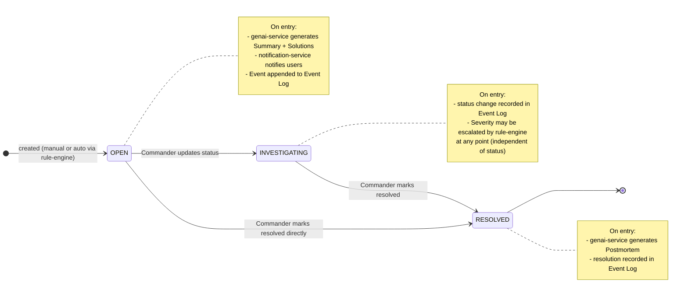
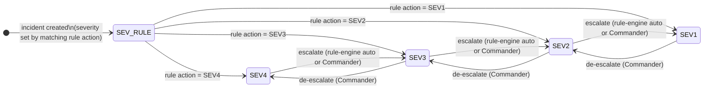

## Incident Management System - Incident Lifecycle State Machine

Shows valid status transitions and the side effects triggered at each state change.

## Severity (independent of status)

Severity is an attribute of the Incident, not a status. It can change in any state.

**Two sources of severity change:**

- **Automatic (rule-engine)**: detects repeated `external.event.received` events from the same source within a time window → publishes `incident.severity.escalate.requested` to NATS → incident-service raises severity one level
- **Manual (Commander)**: overrides severity directly via REST

**Note:** genai-service also suggests a severity level (displayed as advisory in the UI) but does NOT change the actual severity — that is rule-engine or Commander only.

