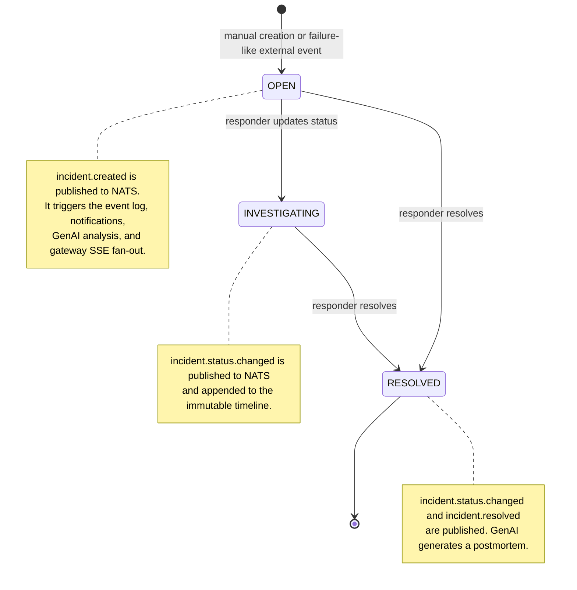

## Incident Management System - Incident Lifecycle State Machine

Severity is independent of lifecycle state. Failure-like external events create a `SEV2` incident through the embedded `incident-service` rule. Responders can later set severity manually; each change publishes `incident.severity.escalated` and creates a timeline event and notification.
