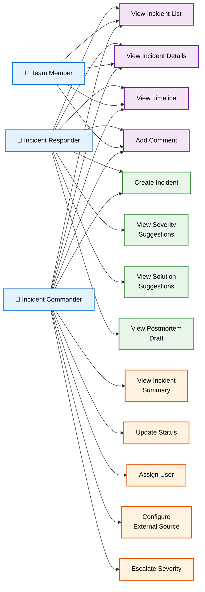

## Incident Management System - Use Case Diagram

```mermaid
graph LR
    %% Actors
    responder["👤 Incident Responder"]
    member["👤 Team Member"]
    commander["👤 Incident Commander"]

    %% Shared Use Cases
    viewList["View Incident List"]
    viewDetails["View Incident Details"]
    viewTimeline["View Timeline"]
    addComment["Add Comment"]

    %% Responder Specific
    createIncident["Create Incident"]
    viewSeverity["View Severity<br/>Suggestions"]
    viewSolutions["View Solution<br/>Suggestions"]
    viewPostmortem["View Postmortem<br/>Draft"]

    %% Commander Specific
    updateStatus["Update Status"]
    assignUser["Assign User"]
    viewSummary["View Incident<br/>Summary"]
    configSource["Configure<br/>External Source"]
    escalateSeverity["Escalate Severity"]

    %% Responder relationships
    responder --> viewList
    responder --> viewDetails
    responder --> viewTimeline
    responder --> addComment
    responder --> createIncident
    responder --> viewSeverity
    responder --> viewSolutions
    responder --> viewPostmortem

    %% Team Member relationships (subset of responder)
    member --> viewList
    member --> viewDetails
    member --> viewTimeline
    member --> addComment

    %% Commander relationships (both shared and specific)
    commander --> viewList
    commander --> viewDetails
    commander --> viewTimeline
    commander --> addComment
    commander --> viewSummary
    commander --> updateStatus
    commander --> assignUser
    commander --> configSource
    commander --> escalateSeverity
commander --> createIncident
    classDef actor fill:#e3f2fd,stroke:#1976d2,stroke-width:2px,color:#000
    classDef shared fill:#f3e5f5,stroke:#7b1fa2,stroke-width:2px,color:#000
    classDef responderOnly fill:#e8f5e9,stroke:#388e3c,stroke-width:2px,color:#000
    classDef commanderOnly fill:#fff3e0,stroke:#e65100,stroke-width:2px,color:#000

    class responder,member,commander actor
    class viewList,viewDetails,viewTimeline,addComment shared
    class createIncident,viewSeverity,viewSolutions,viewPostmortem responderOnly
    class updateStatus,assignUser,viewSummary,configSource,escalateSeverity commanderOnly
```
