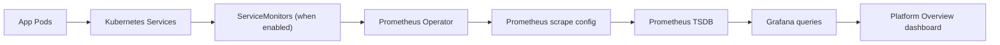
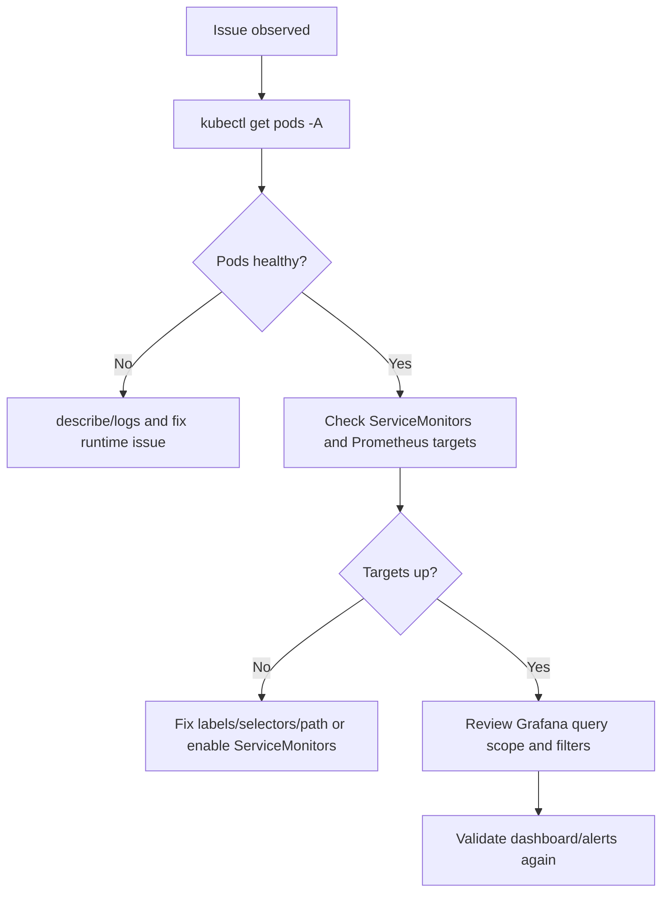
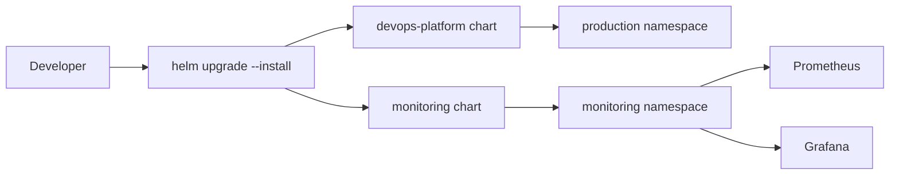

# Kubernetes, Helm, and Monitoring Guide

This guide explains what we set up in this repository in practical, simple terms.

> Note: This document was curated with LLM support because we all are not familiar with Kubernetes and Helm yet. It is meant to be a living document that evolves as we learn and iterate on our monitoring setup. If you have suggestions for improvements or clarifications, please open a PR or issue!

---

## 1) Big Picture

We run our services in **Kubernetes**.
We package deployment config using **Helm charts**.
We observe the system using a **monitoring stack** (Prometheus + Grafana).

Think of it like this:

- **Kubernetes** = the runtime platform that keeps containers alive.
- **Helm** = reusable templates + values that generate Kubernetes YAML.
- **Prometheus/Grafana** = collect metrics and visualize health.

### Tools you need

All tooling is managed via **pixi** — a reproducible package manager for dev environments.

```bash
pixi install                  # set up all environments
pixi run -e deploy <cmd>      # run <cmd> inside the deploy toolchain
```

| Tool      | What it does                                        |
| --------- | --------------------------------------------------- |
| `helm`    | Package and deploy Kubernetes manifests             |
| `kubectl` | Talk to the cluster via CLI                         |
| `sops`    | Decrypt/encrypt secrets files                       |
| `age`     | Encryption key backend used by SOPS                 |
| `k9s`     | Interactive terminal UI for browsing a live cluster |

For local development we use **OrbStack** as the local Kubernetes runtime.
OrbStack is a lightweight macOS app that gives you a local cluster with a context named `orbstack`.
You can also use Docker Desktop or any other cluster — just switch the kubectl context accordingly.

---

## 2) Core Concepts

### Kubernetes (very basic)

Kubernetes manages workloads using objects:

- **Pod**: the smallest running unit (one or more containers).
- **Deployment**: declares how many pod replicas should run.
- **Service**: stable network endpoint for pods.
- **Namespace**: logical grouping (we use `production` and `monitoring`).

Kubernetes continuously reconciles actual state to desired state.
If a pod crashes, Kubernetes recreates it.

### Helm (very basic)

Helm turns templates into Kubernetes manifests.

- A **Chart** is a deployment package.
- `templates/*.yaml` are parameterized manifest templates.
- `values.yaml` provides default config values.
- You can override values with `--set` or extra values files.

In this repo:

- App chart: `infra/helm/devops-platform`
- Monitoring chart: `infra/helm/monitoring`

---

## 3) What is in our Helm charts?

## App chart: `infra/helm/devops-platform`

Main purpose: deploy our application services to `production`.

Important files:

- `templates/deployment.yaml`
  - Creates one Deployment per service.
- `templates/service.yaml`
  - Creates one Service per service.
- `templates/servicemonitor.yaml`
  - Creates ServiceMonitors (only when enabled and CRD exists).
- `values.yaml`
  - Defines service list, ports, image settings, and monitoring toggles.

Services defined in `values.yaml` (each gets a Deployment + Service):

| Service                | Port |
| ---------------------- | ---- |
| `frontend`             | 3000 |
| `gateway`              | 8080 |
| `incident-service`     | 8081 |
| `event-service`        | 8082 |
| `rule-engine`          | 8083 |
| `user-service`         | 8084 |
| `notification-service` | 8085 |
| `webhook-service`      | 8086 |
| `genai-service`        | 8087 |

Important value:

- `monitoring.serviceMonitor.enabled`
  - `false` by default (safe default).
  - Set to `true` to let Prometheus discover app services.

Hardcoded chart defaults to be aware of:

- Each service gets exactly **1 replica** (not configurable via values).
- ServiceMonitor scrape interval: **30s**, path: **`/metrics`**.
- Services must expose a `/metrics` endpoint or they produce no metrics.

## Monitoring chart: `infra/helm/monitoring`

Main purpose: deploy Prometheus + Grafana and related resources.

Important files:

- `Chart.yaml`
  - Declares dependency on `kube-prometheus-stack`.
- `Chart.lock`
  - Locked dependency metadata for deterministic builds.
- `values.yaml`
  - Monitoring stack config (Prometheus/Grafana behavior).
- `templates/alerts.yaml`
  - Custom Prometheus alert rules.
- `templates/platform-dashboard.yaml`
  - Loads our Grafana dashboard JSON.
- `files/platform-overview.json`
  - Dashboard definition shown in Grafana.

Secrets examples (in `infra/helm/secrets/`):

| File                                 | Purpose                                  |
| ------------------------------------ | ---------------------------------------- |
| `values.monitoring.dec.example.yaml` | Grafana admin password (`adminPassword`) |
| `values.prod.dec.example.yaml`       | App secrets: `databaseUrl`, `apiToken`   |

Copy the example files, fill in real values, then encrypt (see section 12).
Never commit `.dec.yaml` files — they are gitignored.

---

## 4) Values files explained

`values.yaml` files are default settings for a chart.

You can override them:

- by CLI:
  - `--set key=value`
- by file:
  - `--values my-overrides.yaml`

Examples:

- Enable app ServiceMonitors:
  - `--set monitoring.serviceMonitor.enabled=true`
- Set image tag:
  - `--set global.image.tag=main`

Why this matters:

- same chart can run in local/dev/prod with different values.
- you avoid hardcoding environment-specific config in templates.

---

## 5) Monitoring flow in our setup

1. App chart deploys services in `production`.
2. If enabled, app chart creates `ServiceMonitor` objects.
3. Prometheus Operator watches ServiceMonitors and configures scraping.
4. Prometheus stores metrics.
5. Grafana queries Prometheus and renders dashboards.

If `ServiceMonitor` is disabled, Grafana may show "No data" for app panels.



---

## 6) Common kubectl commands (what they mean)

### Context and cluster

- `kubectl config current-context`
  - Shows which cluster you are targeting.
- `kubectl cluster-info`
  - Basic control plane health/check.

### Workloads

- `kubectl get ns`
  - List namespaces.
- `kubectl get pods -n production`
  - List pods in `production`.
- `kubectl get all -n monitoring`
  - List common resources in monitoring namespace.

### Debugging

- `kubectl logs -n production <pod-name>`
  - View pod logs.
- `kubectl describe pod -n production <pod-name>`
  - Detailed status/events (great for failures).

### Access local services

- `kubectl -n monitoring port-forward svc/monitoring-grafana 3001:80`
  - Opens Grafana on `http://localhost:3001`.

---

## 7) Common Helm commands (what they mean)

- `helm repo add <name> <url>`
  - Add a chart repository.
- `helm dependency build <chart-dir>`
  - Fetch dependencies using lock metadata.
- `helm lint <chart-dir>`
  - Validate chart templates and structure.
- `helm upgrade --install <release> <chart-dir> ...`
  - Install if missing, otherwise upgrade.
- `helm uninstall <release> -n <namespace>`
  - Remove a release.
- `helm list -A`
  - List all installed releases.

In this repo we usually run Helm via Pixi:

- `pixi run -e deploy helm ...`

---

## 8) k9s basics

`k9s` is an interactive terminal UI for Kubernetes.

Start it:

- `pixi run -e deploy k9s`

Useful keys/commands:

- `:ctx` -> switch context
- `:ns` -> switch namespace
- `:pods`, `:svc`, `:deploy` -> jump to resource type
- `l` (on a pod) -> logs
- `d` (on a resource) -> describe/details
- `q` -> quit

Why use it:

- faster than typing many `kubectl` commands repeatedly.
- great for live troubleshooting.

---

## 9) Typical local workflow (OrbStack)

1. Ensure kube context:
   - `kubectl config use-context orbstack`
2. Deploy app chart:
   - `pixi run -e deploy helm upgrade --install devops-platform infra/helm/devops-platform --namespace production --create-namespace --set global.image.tag=main`
3. Deploy monitoring chart:
   - `pixi run -e deploy helm repo add prometheus-community https://prometheus-community.github.io/helm-charts`
   - `pixi run -e deploy helm dependency build infra/helm/monitoring`
   - `pixi run -e deploy helm upgrade --install monitoring infra/helm/monitoring --namespace monitoring --create-namespace`
4. Open Grafana:
   - `kubectl -n monitoring port-forward svc/monitoring-grafana 3001:80`

---

## 10) Quick troubleshooting

### "No data" in Grafana

Check:

- Are app ServiceMonitors enabled?
  - `kubectl get servicemonitor -A`
- Are app pods running?
  - `kubectl get pods -n production`
- Is Prometheus up?
  - `kubectl get pods -n monitoring`

### Helm monitoring lint fails due to dependency

Run:

- `helm repo add prometheus-community https://prometheus-community.github.io/helm-charts`
- `helm dependency build infra/helm/monitoring`
- `helm lint infra/helm/monitoring`



---

If you are new to this stack, start with:

1. `kubectl get pods -A`
2. `pixi run -e deploy k9s`
3. open Grafana with port-forward

That gives a solid end-to-end view quickly.

---

## 11) Repository layout reference

Quick map of where things live so you can find them without guessing.

### Helm charts

```
infra/helm/
  devops-platform/          # App chart (deploys all 9 services to production)
    Chart.yaml
    values.yaml             # Service list, ports, image registry, monitoring toggle
    templates/
      deployment.yaml       # One Deployment per service
      service.yaml          # One Service per service (port named "http")
      servicemonitor.yaml   # ServiceMonitor per service (gated by flag + CRD)

  monitoring/               # Monitoring chart (Prometheus + Grafana)
    Chart.yaml              # Declares kube-prometheus-stack dependency
    Chart.lock              # Locked dependency version (for reproducible builds)
    values.yaml             # Prometheus/Grafana config, retention, storage
    templates/
      alerts.yaml           # Custom PrometheusRules
      platform-dashboard.yaml  # ConfigMap that loads the Grafana JSON
    files/
      platform-overview.json   # Grafana dashboard definition (edit this to change panels)

  secrets/                  # Secret value templates (gitignored .dec.yaml variants)
    values.monitoring.dec.example.yaml
    values.prod.dec.example.yaml
```

### CI/CD workflows

```
.github/workflows/
  ci.yml                    # Lint, lockfile check, helm lint/dependency build
  deploy-helm-sops.yml      # Manual deploy: decrypts secrets, runs helm upgrade
  release-deploy.yml        # Triggered on semver tags, builds + pushes images
  container-ci.yml          # Builds and validates container images on PRs
```

### Config files

```
.sops.yaml                  # Tells SOPS which files to encrypt and with which AGE key
pixi.toml                   # Tool environments (default, dev, deploy)
```

---

## 12) SOPS basics (how secret values work)

SOPS (Secrets OPerationS) lets us keep secrets encrypted in git.

In simple terms:

- `.dec.yaml` = decrypted/plaintext values (do not commit)
- `.enc.yaml` = encrypted values (safe to commit)

In this repo there are two secrets files (one per chart):

| Example template                     | Encrypted file (committed)   | Contains                      |
| ------------------------------------ | ---------------------------- | ----------------------------- |
| `values.monitoring.dec.example.yaml` | `values.monitoring.enc.yaml` | Grafana `adminPassword`       |
| `values.prod.dec.example.yaml`       | `values.prod.enc.yaml`       | App `databaseUrl`, `apiToken` |

How deploy uses them:

1. GitHub Actions gets `SOPS_AGE_KEY` from repo secrets.
2. Workflow decrypts both `.enc.yaml` files into temporary `.dec.yaml` files.
3. Helm uses those decrypted files via `--values`.
4. Plaintext files are gitignored and never committed.
5. Deploy fails closed if the encrypted files are missing.

Typical local flow:

```bash
# one-time: copy and fill in both example files
cp infra/helm/secrets/values.monitoring.dec.example.yaml infra/helm/secrets/values.monitoring.dec.yaml
cp infra/helm/secrets/values.prod.dec.example.yaml infra/helm/secrets/values.prod.dec.yaml
# edit both files and replace placeholder values

# encrypt -> these encrypted files are committed to the repo
sops --encrypt infra/helm/secrets/values.monitoring.dec.yaml > infra/helm/secrets/values.monitoring.enc.yaml
sops --encrypt infra/helm/secrets/values.prod.dec.yaml > infra/helm/secrets/values.prod.enc.yaml

# decrypt to inspect or edit later
sops --decrypt infra/helm/secrets/values.monitoring.enc.yaml > infra/helm/secrets/values.monitoring.dec.yaml
```

Why this matters:

- we avoid storing raw passwords/tokens in git.
- deploy stays automated because CI can decrypt with the configured key.

---

## 13) How everything connects end-to-end

Here is the lifecycle in plain words:

1. We install with Helm:
   - app chart into `production`
   - monitoring chart into `monitoring`
2. Monitoring chart brings up Prometheus, Grafana, and operator components.
3. App chart can create ServiceMonitors (when enabled and CRDs are available).
4. Prometheus discovers those ServiceMonitors and scrapes metrics endpoints.
5. Grafana reads Prometheus and renders dashboard panels.
6. CI verifies templates and dependencies before merge to catch issues early.
7. Deploy workflow enforces encrypted values presence and deterministic dependency setup.

If one link is missing (for example ServiceMonitors disabled), Grafana can show `No data` even when pods are healthy.



---

## 14) Image flow and tags

Our chart deploys container images from:

- `ghcr.io/aet-devops26/team-panic-at-the-console/<service>:<tag>`

The tag comes from:

- `global.image.tag` in Helm values
- or `--set global.image.tag=...` at deploy time

Why this matters:

- If the tag does not exist in GHCR, pods cannot start.
- Kubernetes will show `ImagePullBackOff` or `ErrImagePull`.

Quick checks:

```bash
kubectl get pods -n production
kubectl describe pod -n production <pod-name>
```

Look for events like:

- `Failed to pull image`
- `manifest unknown`
- authentication/permission errors

---

## 15) Helm release lifecycle and rollback

Helm tracks release history by revision.

Useful commands:

```bash
pixi run -e deploy helm list -A
pixi run -e deploy helm history devops-platform -n production
pixi run -e deploy helm rollback devops-platform <REVISION> -n production
```

Typical recovery flow:

1. A new deploy introduces a bad values/template change.
2. Check release history.
3. Roll back to the previous known-good revision.
4. Verify pod health and service availability.

---

## 16) Environment model (local vs CI/prod)

There are three practical contexts:

- **Local OrbStack**
  - fast feedback, manual commands, local kube context.
- **CI (pull_request / merge_group)**
  - static checks (lint, lockfile, helm lint/build checks).
- **Deploy workflow (production environment)**
  - decrypts secrets and performs real `helm upgrade --install`.

### Practical differences

- Local can use plaintext local files during experimentation.
- CI should not depend on private runtime state.
- Deploy workflow must fail closed if required secrets/files are missing.

---

## 17) Secrets and key management (SOPS + AGE)

**AGE** is an encryption algorithm. SOPS uses it to encrypt/decrypt files.
The key pair is:

- **Public key** — in `.sops.yaml` in the repo root, used to encrypt files.
- **Private key** — never committed; stored in GitHub Actions secrets as `SOPS_AGE_KEY`.

`.sops.yaml` tells SOPS which files to encrypt and with which public key:

```yaml
creation_rules:
  - path_regex: infra/helm/secrets/.*\.enc\.ya?ml$
    age:
      - age1<your-team-public-key>
```

Beyond basic usage, the operational part is key management.

Recommendations:

- Keep AGE private key material only in secure secret storage.
- Rotate keys intentionally and re-encrypt files when rotating.
- Never commit decrypted `.dec.yaml` files.

When decryption fails, check:

1. `SOPS_AGE_KEY` is present in workflow secrets.
2. Key format is valid and includes full private key block.
3. Public key in `.sops.yaml` matches the private key in `SOPS_AGE_KEY`.
4. File path is correct (`infra/helm/secrets/...enc.yaml`).

---

## 18) Pod state vs application readiness

`Running` is necessary, but not always sufficient.

- `Pod Running` means container process is alive.
- It does not always mean the app is healthy for traffic.

What to inspect:

```bash
kubectl get pods -n production
kubectl describe pod -n production <pod-name>
kubectl logs -n production <pod-name>
```

Check for:

- crash loops
- startup exceptions
- failed dependencies (DB/NATS)

---

## 19) Prometheus target troubleshooting

If Grafana shows no data, verify scrape discovery first.

1. Ensure ServiceMonitors exist:
   - `kubectl get servicemonitor -A`
2. Open Prometheus UI with port-forward:
   - `kubectl -n monitoring port-forward svc/monitoring-kube-prometheus-prometheus 9090:9090`
3. Visit Prometheus targets page:
   - `http://localhost:9090/targets`

Common root causes:

- ServiceMonitors disabled in values.
- Service label/selector mismatch.
- endpoint path wrong (for example `/metrics` missing).
- namespace/label query filters excluding targets.

---

## 20) Alert design and noise control

Alerts should be useful, not noisy.

Rules of thumb:

- alert on meaningful symptoms (availability, error rates, saturation).
- avoid alerts that fire by default in known non-instrumented states.
- keep severities clear (`critical` vs `warning`).

### Current alert rules (`infra/helm/monitoring/templates/alerts.yaml`)

All rules are scoped to `namespace="production"`.

| Alert                | Expression                                                    | Wait | Severity | Meaning                                                                   |
| -------------------- | ------------------------------------------------------------- | ---- | -------- | ------------------------------------------------------------------------- |
| `ServiceDown`        | `kube_deployment_status_replicas_unavailable > 0`             | 2m   | critical | A deployment has had unavailable replicas for 2 minutes                   |
| `PodNotReady`        | `kube_pod_status_ready{condition="false"} == 1`               | 5m   | warning  | A pod has been unready for 5 minutes                                      |
| `HighPodRestartRate` | `increase(kube_pod_container_status_restarts_total[15m]) > 5` | 0m   | warning  | A container restarted more than 5 times in 15 minutes (fires immediately) |

Note: `HighPodRestartRate` has `for: 0m` which means it fires instantly with no grace period.

In this repo, availability logic is based on deployment/pod state rather than application-level metrics to reduce noise while services are still maturing their `/metrics` endpoints.

---

## 21) Dashboard ownership and query hygiene

Dashboard files are versioned in git:

- source JSON: `infra/helm/monitoring/files/platform-overview.json`
- loaded by chart template: `templates/platform-dashboard.yaml`

### Current dashboard panels (Platform Overview)

All queries are scoped to `namespace="production"`.

| Panel                  | Type             | What it shows                                |
| ---------------------- | ---------------- | -------------------------------------------- |
| Service Health         | Stat (green/red) | `up` metric per service — 1 = up, 0 = down   |
| Pod Restarts (last 1h) | Timeseries       | Container restart count over time            |
| Service Uptime         | Timeseries       | `up` metric over time                        |
| Deployed Versions      | Timeseries       | Deployment label `app.kubernetes.io/version` |

The dashboard is discovered by Grafana automatically via the sidecar label `grafana_dashboard: "1"`.
To update panels: edit `files/platform-overview.json` and redeploy the monitoring chart.

Guidelines:

- scope queries intentionally (for example namespace filters).
- avoid cluster-wide queries when dashboard intent is platform-only.
- review query changes like code changes (because they affect operational decisions).

---

## 22) Monitoring cost/performance basics

Monitoring has resource impact.

Main levers:

- retention period
- scrape interval
- label cardinality
- PVC storage size

In this setup:

- retention and storage are configured in monitoring values.
- if PVC fills up, reduce retention or increase storage.

---

## 23) Quick incident runbook

Use this sequence when something looks broken.

### A) Deploy failed

1. Check workflow logs (lint/dependency/decrypt step).
2. Re-run equivalent local command.
3. If release partially applied, inspect:
   - `helm list -A`
   - `helm history <release> -n <namespace>`

### B) Pods unhealthy

1. `kubectl get pods -A`
2. `kubectl describe pod ...`
3. `kubectl logs ...`

### C) Grafana no data

1. Check ServiceMonitors.
2. Check Prometheus targets page.
3. Check dashboard query scope and labels.

### D) Need fast rollback

1. Find prior revision:
   - `helm history <release> -n <namespace>`
2. Roll back:
   - `helm rollback <release> <revision> -n <namespace>`
